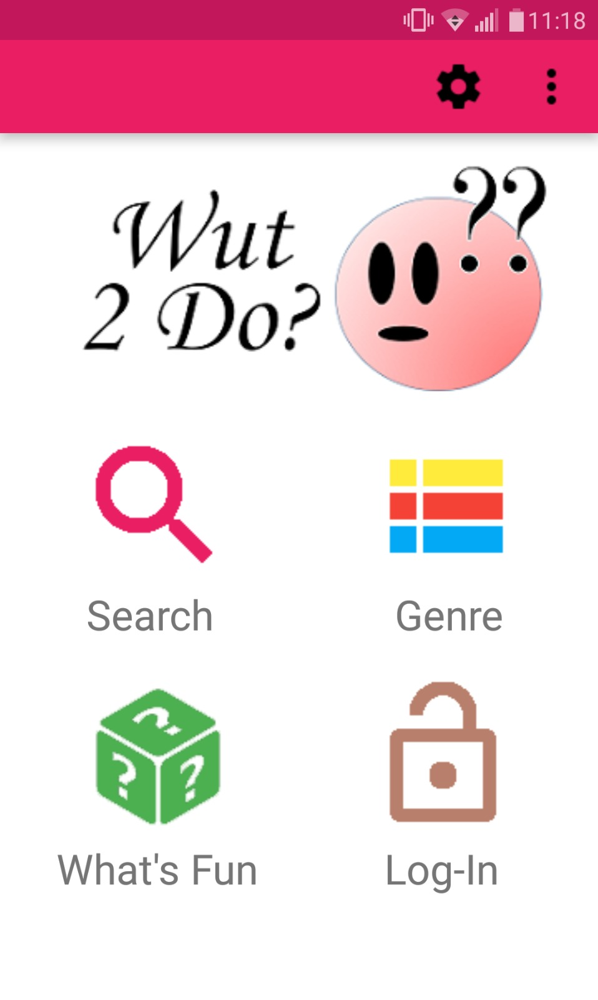
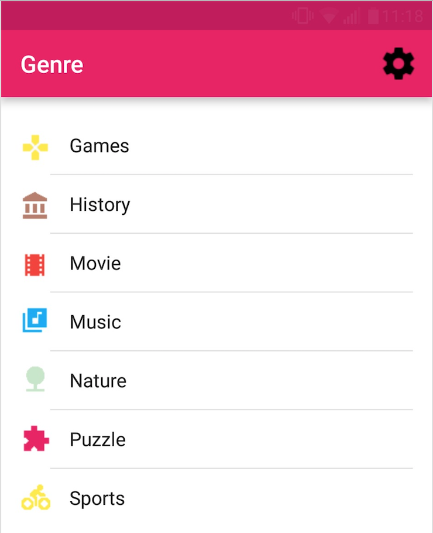
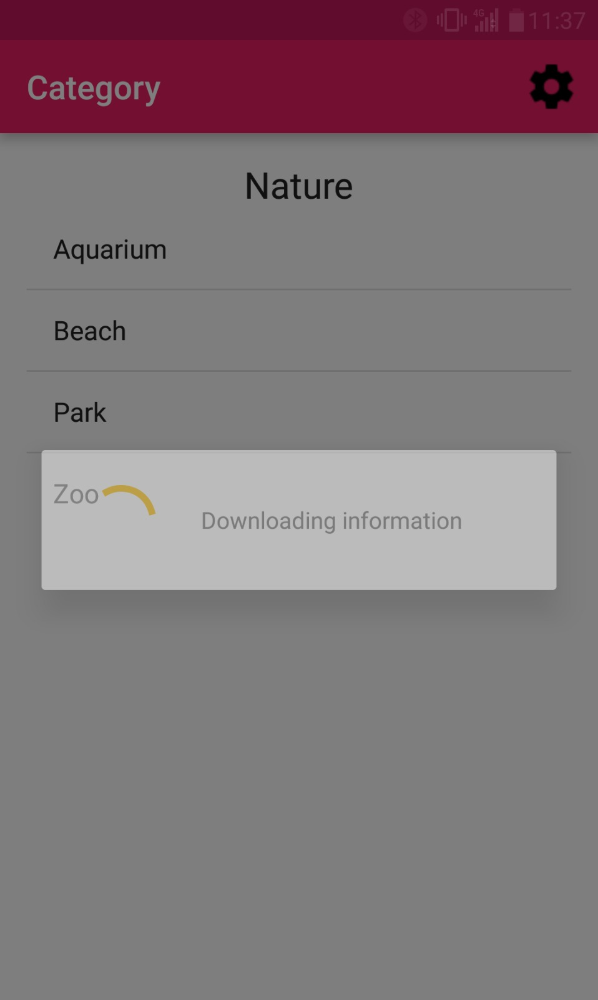
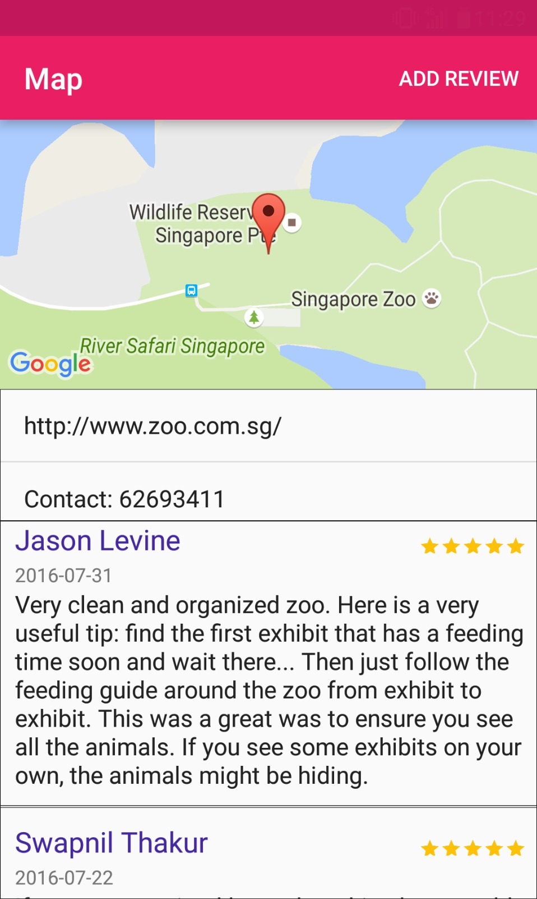

## Overview
Sometimes during a meet up with a group of friends, we may have trouble finding activities to do. This is where our app Wut 2 Do comes in. It enables users to find entertainment near them based on their current location.

## Features
(Main functions) Search for entertainment near you by:
1. Browsing through the available categories in the application.
1. Searching for specific activities that you are interested in.
1. Search for the building or town name, in which all the entertainment in the building or the town will be listed down.
1. Random suggestion, which will be further refined to be more relevant to the user’s interests based on user's past search history as the user continue to use the application. 

(Additional functions) 
1. Allow users to create accounts and have their past searches saved.
1. Allow users add in their own reviews of the locations they have been to.

## User stories
1. As a group of friends, I want to locate entertainment near me so that I can find something enjoyable to do with my friends.
1. As a user, I want to be able to quickly search for entertainment around an area that I am planning to visit.
1. As a user, I want to be able to leave review for the location I visit.
1. As a user, I want to receive suggestions that are relevant to me and what I like.

## Scope of project
At the moment, we are planning to develop this app for locations in Singapore only.

## Screenshots
 
_Figure 1. Main Page_  

 
_Figure 2. Genre Page_  

 
_Figure 3. Category Page_  

 
_Figure 4. Map Page_  
